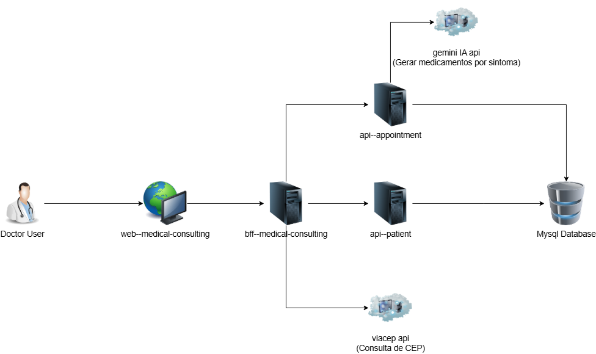

# Api Paciente (Patient) - Projeto MVP

Projeto MVP para disciplina **Desenvolvimento Backend Avançado** 

Este projeto é uma aplicação back-end desenvolvida com Python Utilizando Flask. O objetivo é criar um serviço para interagir com front-end permitindo adicionar, editar, excluir e visualizar informações dos pacientes.

### Modelo de Arquitetura:

1. **Camada de Frontend (React)**:
   - Aplicação `react web--medical-consulting` é responsável por interagir com os e fazer a integração com a API.

2. **Camada de BFF (Backend For Frontend)**:
   - A API `bff--medical-consulting` utiliza arquitetura bff (backend for front end), processando as solicitações e coordenando as interações entre a aplicação e os serviços backend.

3. **O BFF se conecta as seguintes apis**:
   - `api--patient`: Gerencia os dados dos pacientes (ex.: informações de cadastro, histórico médico).
   - `api--appointment`: Lida com agendamentos e consulta a serviços externos.
   - `viacep (externa)`: Serviço externo para obter endereços com base nos CEPs fornecidos.

4. **Integração com Serviço Externo**:
   - A API `api--appointment` conecta-se à `API do Google Gemini`, que retorna os medicamentos recomendados com base nos sintomas.




## Funcionalidades

- **Cadastro de Pacientes**: Permite adicionar novos pacientes com informações como nome, email, telefone, idade e endereço.
- **Alteração de Pacientes**: Permite alterar as informações dos pacientes existentes.
- **Busca de Pacientes**: Permite buscar as informações dos pacientes existentes para edição.
- **Exclusão de Pacientes**: Permite excluir pacientes do banco de dados.
- **Visualização de Pacientes**: Lista todos os Pacientes cadastrados filtrando por nome.


## Tecnologias Utilizadas

- **Python**: Linguagem de programação principal utilizada no projeto.
- **Flask**: Framework para desenvolvimento da API.
- **SQLite**: Banco de dados utilizado para armazenar os dados dos pacientes e endereços.
- **Pydantic**: Biblioteca para validação de dados e definição de esquemas.
- **flask-openapi3**: Biblioteca para documentação da API.

## Instalando o projeto

Será necessário ter o python instalado. A versão indicada é a 3.12.6 e a do pip é a 24.2. 
Após clonar o repositório, é necessário ir ao diretório raiz do projeto, pelo terminal, para poder executar os comandos descritos abaixo.

> É fortemente indicado o uso de ambientes virtuais do tipo [virtualenv](https://virtualenv.pypa.io/en/latest/installation.html).

Instale o venv:

```
 python -m venv .venv 
```

Ative o Venv com o comando abaixo:

```
 .venv\Scripts\activate
```

Assim que ativado, instale as depedencias.

```
(env)$ pip install -r requirements.txt
```

Este comando instala as dependências/bibliotecas, descritas no arquivo `requirements.txt`.

Crie um arquivo .env e coloque o o conteúdo:

```
DB_HOST=localhost
DB_PORT=3306
DB_USER=root
DB_PASSWORD=password
```


## Rodando a aplicação

Para executar a API  basta executar:

```
(env)$ flask run --host 0.0.0.0 --port 3000
```

Em modo de desenvolvimento é recomendado executar utilizando o parâmetro reload, que reiniciará o servidor
automaticamente após uma mudança no código fonte. 

```
(env)$ flask run --host 0.0.0.0 --port 3000 --reload
```

## Rodando Testes

Esta aplicação possui testes unitários. Para rodar os testes, basta instalar
o projeto e em seguida executar o comando abaixo:

```
(env)$ pytest
```

Observação: Esta aplicaçao precisa do mysql rodando para o teste, pois o 
pytest também executa teste de conexão com banco de dados.

## Rodando via Docker (Precisa ter o Docker Instalado)

Rodando via docker-compose

Para criar o banco de dados mysql, execute o comando abaixo:

```
docker-compose up
```

Execute o comando para gerar a imagem via Docker

```
docker build -t api--patient .
```

Para executar o container, rode o comando abaixo:

```
docker run --name api--patient \
    --network api-backend \  
    -p 3000:5000 \
    -e DB_PASSWORD=<SENHA DO BANCO> \
    -e DB_USER=<USUARIO DE BANCO> \
    -e DB_HOST=<IP DO BANCO> \ 
    -e DB_PORT=<PORTA DO BANCO> \ 
    api--patient:latest
```

## Documentação OpenAPI

A documentação OpenAPI da API está disponível em:

- **URL**: `[http://localhost:3000/openapi/swagger](http://localhost:3000/openapi/swagger)`


## POSTMAN

Para executar, importe as collections do postman 

```
api--patient.postman_collection.json
```

## Autor
Clayton Morais de Oliveira
